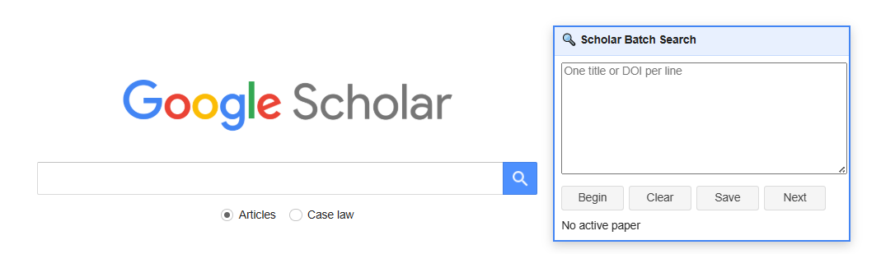

# Google Scholar Search & PDF Downloader

An easier way to search multiple papers on Google Scholar in a row, save them to your library, and download PDFs.

---

## Overview

This browser extension adds a simple control panel directly to Google Scholar. It helps you search many papers one after another, save them to your Google Scholar Library, and download available PDFs with minimal effort.

It is useful for tasks such as collecting papers, checking reference lists, and organizing literature.

---

## Features

### Search and save multiple papers quickly

Paste a list of paper titles or DOIs into the extension panel. Each paper is searched one by one in Google Scholar. With a single click, you can save the paper to your Google Scholar Library before moving on to the next one.

  

### Download PDFs from your library

Download available PDFs for saved papers from your Google Scholar Library in one click. PDFs are saved automatically to your default Downloads folder, without repeated save pop-ups.

### Simple, minimalist control panel

Everything is controlled through buttons you click. The panel is easy to navigate, lets you select only the papers you want, and includes select-all and deselect-all options for quick actions. The interface stays clean and focused, without unnecessary menus or clutter.

---

## Privacy

This extension does not collect personal data, track browsing activity, or send information anywhere.

All functionality runs locally in your browser and only on Google Scholar pages.

The extension does not bypass paywalls or access restricted content. PDF availability depends on publisher access and Google Scholar indexing.

