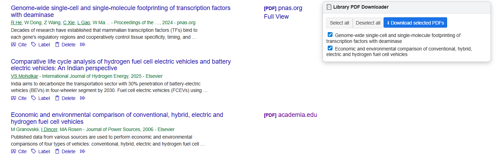

# Google Scholar Search & PDF Downloader

An easier way to search multiple papers on Google Scholar in a row, save them to your library, and download PDFs.

---

## Overview

This browser extension adds a simple control panel directly to Google Scholar. It helps you search many papers one after another, save them to your Google Scholar Library, and download available PDFs with minimal effort.

It is useful for tasks such as collecting papers, checking reference lists, and organizing literature.

---

## Features

### Search and save multiple papers quickly

Paste a list of paper titles or DOIs into the extension panel. Papers are searched sequentially. With a single click, you can save the paper to your Google Scholar Library before moving on to the next one.

  

### Download PDFs from your library

Download available PDFs for saved papers from your Google Scholar Library in one click. PDFs are saved automatically to your default Downloads folder, without repeated save pop-ups.

  

### Simple, minimalist control panel

A streamlined, minimalist control panel keeps the workflow fast and intuitive — just straightforward controls that let you get through your papers efficiently.

  

---
## Installation

You can install the extension locally in Chrome using Developer Mode.

### Step 1: Download the repository

Clone or download this repository to your computer.

If you download the ZIP from GitHub:
- Extract it
- Open the extracted folder
- Make sure you can see the folder named `gs-s&d`

### Step 2: Open Chrome Extensions page

1. Open Chrome
2. Go to: `chrome://extensions`
3. Turn on **Developer mode** (top right corner)

### Step 3: Load the extension

1. Click **Load unpacked**
2. Select the `gs-s&d` folder (the folder that contains `manifest.json`)
3. Click **Select Folder**

The extension should now appear in your Chrome extensions list.

### Step 4: Use the extension

1. Open Google Scholar
2. The control panel should appear automatically
3. You’re ready to search and download PDFs

---
## Privacy

This extension does not collect personal data, track browsing activity, or send information anywhere.

All functionality runs locally in your browser and only on Google Scholar pages.

The extension does not bypass paywalls or access restricted content. PDF availability depends on publisher access and Google Scholar indexing.

